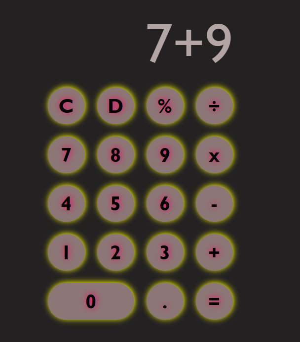

# Calculator Project

A simple web-based calculator built with HTML, CSS and JavaScript.

## Features

- Basic math operations: addition, subtraction, multiplication, division
- Percent calculation
- Clear (`C`) and delete/backspace (`D`) buttons
- Decimal support
- Responsive button grid layout

## Files

- `main.html` - Calculator markup and button layout
- `style.css` - Calculator styling and layout
- `index.js` - Button logic, expression evaluation, and display updates

## How to use

1. Open `main.html` in your browser.
2. Click the buttons to build an expression.
3. Press `=` to evaluate the expression.
4. Press `C` to clear the display.
5. Press `D` to remove the last entry.

## Notes

- The calculator converts `x` to `*` and `÷` to `/` before evaluating the expression.
- The decimal button uses `.` for number input.

